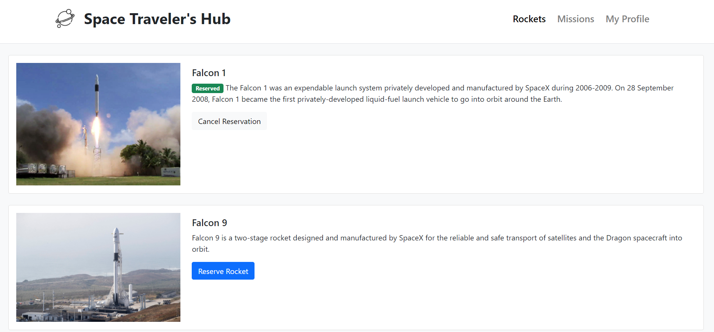

# Space Traveller

>  "Space Travelers' Hub" is a web application for a company that provides commercial and scientific space travel services, We have been working with the real live data from the SpaceX API. The application will allow users to book rockets and join selected space missions. The Space Travelers' Hub consists of Rockets, Missions, and the My Profile section.

---
## Live Demo
- [@Link](https://spacetraveller.netlify.app/)

## Screenshots

Application Screenshot                                                                                   |
:---------------------------------------------------------------------------------------------------:|
                                                                     |

Application Gif                                                                               |
:---------------------------------------------------------------------------------------------------:|
                                                                     |


## Built With

- ReactJS
- Redux
- React-Bootstrap

## Getting Started

To get a local copy up and running follow these simple example steps.

```
git clone https://github.com/Hector096/SpaceTraveller.git
```

and then run

```
npm i
npm start
```

## Installation

to build a production version to `bulid` folder run

```
npm run build
```

## Authors
:bearded_person: **Hector**
  - GitHub: [@githubhandle](https://github.com/Hector096)
  - Linkedin: [@linkedinhandle](https://www.linkedin.com/in/hector096/)


👤 **Muhammad Mustapha Sesay**

- GitHub: [@mmsesay](https://github.com/mmsesay)
- Twitter: [@DeeMaejor](https://twitter.com/DeeMaejor)
- LinkedIn: [Muhammad M Sesay](https://linkedin.com/in/muhammad-m-sesay)


## 🤝 Contributing

Contributions, issues, and feature requests are welcome!

Feel free to check the [issues page](https://github.com/Hector096/SpaceTraveller/issues).


## Acknowledgements

* [ReactJS Organization](https://reactjs.org/) for the amazing [Documentation](https://reactjs.org/docs/getting-started.html) on React.
* [Redux Organization](https://redux.js.org/) for the amazing [Redux Essentials Tutorial](https://redux.js.org/tutorials/essentials/part-1-overview-concepts) on React.

## Show your support

Give a ⭐️ if you like this project!
